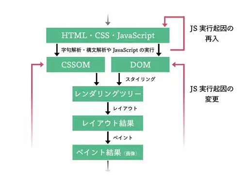
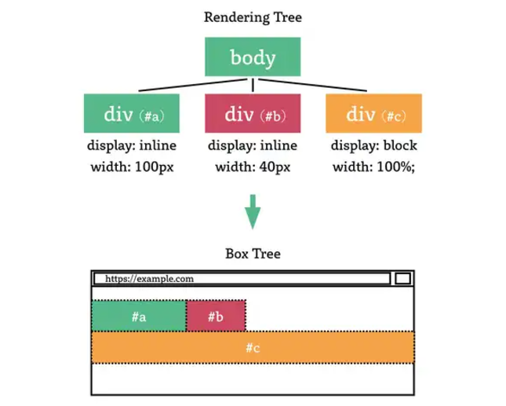

This is readme!
let's create a small browser.
this browser is seem to be made from Rust.

Memo

# Part1

## 前提を整理する
レンダリングツリー：ブラウザ内部での中間表現  
Web IDL：Web ブラウザが提供している、JavaScript エンジンに対するインターフェイス。DOM API や Fetch API がその例。  
IDL (Interface Definition Language)：プログラミング言語に依存しない言語。異なるプログラムやコンポーネント間で通信を行うためのインターフェースを定義するために使用される。  
Binding：JavaScript と Web ブラウザ側実装を繋げるコード。その一部は、Web IDL をもとに生成されている。  

画面生成の過程  
  

JSが介入する場合  

## HTML を取り扱う
パース処理：HTML 文字列を DOM のようなツリーに変換する処理  
クレート：Rustプログラミング言語におけるコードのパッケージ（モジュール化された単位）  
EBNF (Extended Backus-Naur Form) ：コンピュータ言語やデータ形式の文法を記述するための形式的な記法の一つ。文法規則を簡潔かつ柔軟に記述するために使われます。  
to_string() ： &str から String を生成する。Rustには&strとStringという型が存在する。データの保存領域が違うっぽいよくわからず。 

HTMLからDOMが生成される  

EBNF (Extended Backus-Naur Form)   

## レンダリングツリーを作る

レンダリングツリー：DOM と CSSOMから構築される、画面描画の手前のステップで作成される中間構造。「DOM ツリー中の各ノードに、最低限それに対応する CSS プロパティを紐づけたものであって、かつ display: none プロパティが指定されたノードが含まれないもの」とこのサイトでは定義している    
スタイル（Style）：レンダリングツリーを作成するプロセス  
User Agent (UA) ：ウェブブラウザやクライアントアプリケーションを指す用語。ブラウザとか。
User Agent Style Sheet：ブラウザ（User Agent）によってデフォルトで適用されるCSS

## レンダリングする

レイアウト：　最終的な描画処理の前に実行される、Web ブラウザ画面内でのレンダリングツリーの各要素の位置や幅・高さ などを決定する処理  

box tree : レイアウト処理の結果  
box：box tree の各要素  

ペイント: レイアウト処理の後に実施する、画面に描画するための処理。   

# Part2

## JavaScript と Web
WebAssembly (Wasm)：　ブラウザ上で動作するためのバイナリ形式のコードを記述する仕組みです。C、C++、Rust、Goなどの言語で書いたコードをWebAssemblyに変換すれば、JavaScriptの代わりにAPIを使えるようになります。（GPT）
Transpiling（トランスパイル）：　PythonやTypeScript、Ruby、Dartなどの言語をJavaScriptに変換（トランスパイル）して利用する方法です。この方法では、変換後のコードが最終的にJavaScriptになるため、ブラウザAPIを問題なく使えます。（GPT）
→結局JavaScriptに変換する必要があるっぽい
バインディング： JavaScript エンジンと Web ブラウザ実装をつなげること。二つをつなぐバインディングコードはWebIDLを参考にして自動生成されるらしい。ほんまか？すごすぎる

